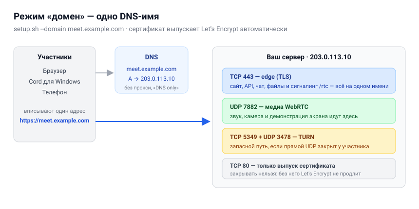
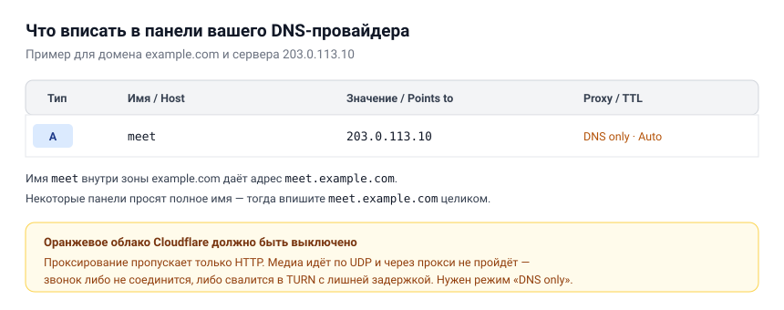
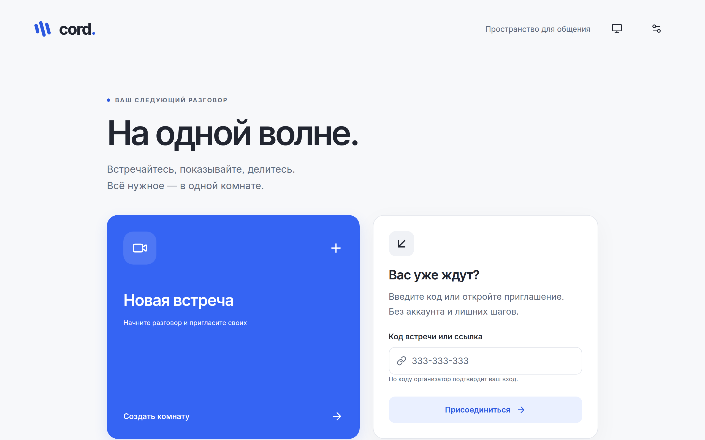
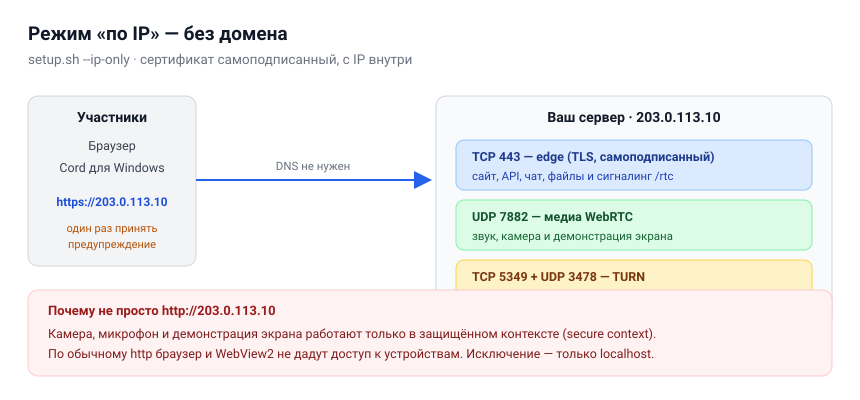
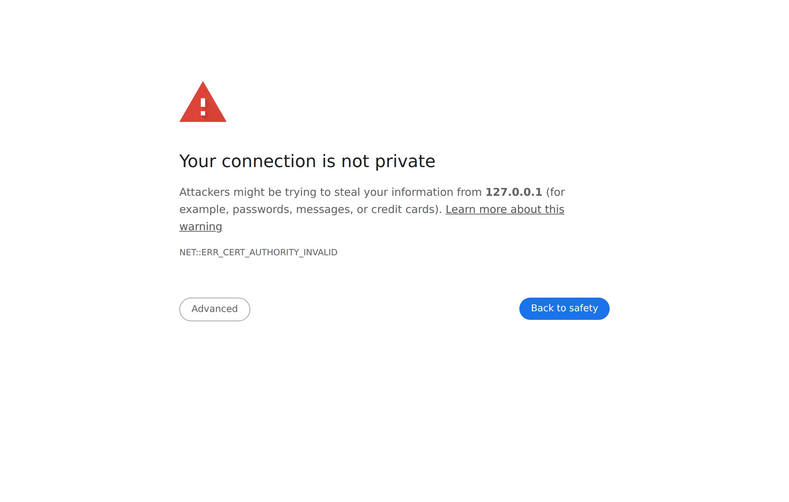

# Свой сервер Cord — установка с нуля

Cord работает как TeamSpeak: серверов может быть сколько угодно, они друг о друге не знают,
а люди просто вписывают адрес нужного и заходят. Эта инструкция проводит от «арендовал
железо» до «друзья зашли и разговаривают».

Ставить нужно **один раз и одной командой**. Всё остальное — копипаста по шагам.

---

## Содержание

1. [Что понадобится](#1-что-понадобится)
2. [Выбор режима: с доменом или по IP](#2-выбор-режима-с-доменом-или-по-ip)
3. [Путь A — с доменом и HTTPS (рекомендуется)](#3-путь-a--с-доменом-и-https)
4. [Путь B — без домена, по IP-адресу](#4-путь-b--без-домена-по-ip-адресу)
5. [Как подключаются люди](#5-как-подключаются-люди)
6. [Обслуживание сервера](#6-обслуживание-сервера)
7. [Если что-то не работает](#7-если-что-то-не-работает)
8. [Безопасность и приватность](#8-безопасность-и-приватность)

---

## 1. Что понадобится

### Железо

| Параметр | Минимум | Рекомендуется | Откуда это число |
| --- | --- | --- | --- |
| Ядер CPU | **2** | **4** | Пересылка 10 участников в 1080p — 25 % одного ядра. Второе ядро нужно ядру Java, базе и TLS, а не медиа |
| Частота | **от 2,5 ГГц** | **от 3,0 ГГц** | Замер сделан на 3,4 ГГц. Пересылка однопоточна по соединению: частота здесь полезнее лишних ядер |
| Память | **4 ГБ** | **8 ГБ** | Стек в простое 723 МиБ, JVM ограничена 2 ГБ, сборка веб-клиента берёт ещё около 0,7 ГБ |
| Диск | **20 ГБ** | **40 ГБ SSD** | Образы, база, временные файлы встреч, журналы (потолок 100 МБ на службу) |
| Канал | **100 Мбит/с** симметрично | **1 Гбит/с** | Комната из 6 человек с камерами и одной демонстрацией — 57–104 Мбит/с отдачи |
| IP | публичный IPv4 | публичный IPv4 | За NAT без проброса портов работать не будет |

Подойдёт почти любой VPS, и это не фигура речи: **процессор здесь почти никогда не
упирается первым**. Сервер не пересжимает видео — он принимает пакеты и пересылает их тем,
кто подписан. Замерено на боевом сервере: **одно ядро вывозит 170–200 Мбит/с пересылки**, а
десять участников в 1080p занимают четверть ядра и 114 МиБ памяти.

Упирается канал. Десять человек с включёнными камерами — это сотни мегабит исходящего
трафика, и никакая частота процессора их не создаст.

**Три вещи, на которых легко ошибиться при выборе тарифа:**

- **«До 1 Гбит/с» с оверселлингом хуже честных 100 Мбит/с.** Смотрите на гарантию полосы,
  а не на цифру в заголовке.
- **Не делите ядра медиасервера со сборкой.** На этом сервере при сборке образов SFU
  замирал на 32–48 секунд — это видно в его собственном журнале. Собирать можно там же, но
  не во время встреч.
- **Низкий пинг до сервера — это не мощность сервера.** Переезд с 60 мс на 3 мс снимает
  114 мс из общей задержки и очень заметен, но он не трогает ни кодирование у отправителя,
  ни декодирование у слушателя.

Подробный разбор с методикой замера, формулой на свой случай и командой, которой это
перепроверяется, — в [capacity.md](capacity.md). Что происходит, когда включены сразу
микрофон, камера, демонстрация и музыка, — там же.

### Сколько людей выдержит

Потолок комнаты в Cord — **10 участников и 2 демонстрации**, он задан в конфигурации SFU
(`room.max_participants`). До этого потолка при рекомендованном железе упереться в сервер
не получится; упереться в канал — можно, если у всех включены камеры в полном качестве.

### Операционная система

**Ubuntu 22.04 / 24.04** или **Debian 12**, свежеустановленная, с доступом root по SSH.
Скрипт установки рассчитан на `apt` и systemd. Архитектура x86_64 или ARM64.

### Что НЕ нужно

Ничего ставить руками не надо: ни Docker, ни Node.js, ни базу, ни веб-сервер.
`setup.sh` поставит всё сам.

---

## 2. Выбор режима: с доменом или по IP

Есть два рабочих режима. Разница только в том, есть ли у вас доменное имя.

| | **Путь A — домен** | **Путь B — по IP** |
| --- | --- | --- |
| Нужен домен | да, одно имя | нет |
| Сертификат | Let's Encrypt, автоматически | самоподписанный |
| Предупреждение в браузере | нет | да, один раз у каждого |
| Адрес для людей | `https://meet.example.com` | `https://203.0.113.10` |
| Когда выбирать | постоянный сервер для людей | проверить прямо сейчас, домашняя сеть |

**Если домен есть — берите путь A.** Он проще для тех, кто будет подключаться: никаких
пугающих красных экранов.

### Важное ограничение, которое нужно знать заранее

Камера, микрофон и демонстрация экрана работают **только в защищённом контексте**
(secure context). Это правило самих браузеров, а не настройка Cord.

Поэтому **обычный `http://` по IP-адресу не подойдёт**: браузер и WebView2 просто не дадут
доступ к устройствам, и встреча не состоится. Единственное исключение — `localhost` на той
же машине.

Отсюда и два режима: либо настоящий сертификат на домен, либо самоподписанный на IP.
Третьего рабочего варианта нет.

---

## 3. Путь A — с доменом и HTTPS



### Шаг 1. Возьмите сервер

Арендуйте VPS у любого провайдера. При заказе выберите Ubuntu 24.04. После оплаты вы
получите **IP-адрес** и пароль root (или ключ).

Регион выбирайте ближе к людям, которые будут созваниваться: задержка до сервера
складывается у всех участников.

### Шаг 2. Направьте домен на сервер

В панели вашего регистратора добавьте одну **A-запись**:



```
Тип:     A
Имя:     meet                 (получится meet.example.com)
Значение: 203.0.113.10        (IP вашего сервера)
Proxy:   выключен / DNS only
TTL:     авто
```

> **Cloudflare:** оранжевое облачко должно быть **серым**. Проксирование пропускает только
> HTTP, а видео идёт по UDP — через прокси звонок не соединится.

Подождите несколько минут и проверьте со своего компьютера:

```bash
ping meet.example.com
```

Должен ответить ваш IP. Пока не отвечает — дальше идти рано, сертификат не выпустится.

### Шаг 3. Зайдите на сервер

```bash
ssh root@203.0.113.10
```

### Шаг 4. Установите Cord одной командой

```bash
git clone https://github.com/MikkiMays/ModernStreamingSystem.git
cd ModernStreamingSystem
sudo ./setup.sh --domain meet.example.com
```

Всё. Скрипт сам:

- проверит машину и объём памяти;
- поставит Docker;
- убедится, что домен указывает сюда;
- сгенерирует пароли и конфигурацию;
- настроит firewall, оставив ваш SSH открытым;
- соберёт и запустит сервисы;
- получит сертификат Let's Encrypt;
- дождётся готовности и проверит адрес.

Первая установка занимает **5–15 минут** — в основном сборка. Экран не пустой: скрипт
пишет, что делает.

> Если SSH у вас не на 22 порту, добавьте `--ssh-port 2222`, иначе firewall вас отрежет.

В конце появится:

```
  ────────────────────────────────────────────────────────────
   Cord is running.

   Server address:  https://meet.example.com

   Open that address in a browser, or paste it into Cord
   for Windows under  Settings → Servers → Add server.
  ────────────────────────────────────────────────────────────
```

### Шаг 5. Включите продление сертификата

Сертификат Let's Encrypt живёт 90 дней. Caddy продлевает его сам, но TURN читает файл
только при запуске, поэтому нужна одна строка в cron (скрипт напечатает её готовой):

```bash
(crontab -l 2>/dev/null; echo "17 4 * * * cd /root/ModernStreamingSystem && bash scripts/turn-cert.sh >> /var/log/cord-turn-cert.log 2>&1") | crontab -
```

Перезапуск происходит **только когда сертификат реально сменился** — примерно раз в два
месяца. В этот момент активные звонки прервутся, поэтому в примере выбраны 4 часа ночи.

### Шаг 6. Проверьте

Откройте `https://meet.example.com` в браузере. Должна открыться главная:



Замок в адресной строке — закрытый, без предупреждений. Нажмите «Создать комнату»,
разрешите камеру и микрофон, скопируйте приглашение и откройте его на телефоне.

---

## 4. Путь B — без домена, по IP-адресу



Подходит, чтобы проверить всё прямо сейчас или поднять сервер в домашней сети.

### Шаг 1. Зайдите на сервер и установите

```bash
ssh root@203.0.113.10
git clone https://github.com/MikkiMays/ModernStreamingSystem.git
cd ModernStreamingSystem
sudo ./setup.sh --ip-only
```

IP определится автоматически. Если машина за NAT и снаружи у неё другой адрес, укажите
явно: `sudo ./setup.sh --ip-only --ip 203.0.113.10`.

DNS не нужен, порт 80 не нужен, ждать сертификат не нужно.

### Шаг 2. Откройте адрес и примите предупреждение

Откройте `https://203.0.113.10`. Браузер покажет вот это:



Это нормально и ожидаемо: сертификат выпустили вы сами, а не известный центр сертификации.
Нажмите **«Дополнительно» → «Перейти на сайт (небезопасно)»**.

В английском интерфейсе: **Advanced → Proceed to 203.0.113.10 (unsafe)**.

После этого браузер запомнит решение, и камера с микрофоном заработают как обычно.
Каждому участнику нужно сделать это один раз на своём устройстве.

> **Почему нельзя просто http://** — см. [раздел 2](#важное-ограничение-которое-нужно-знать-заранее).
> Браузер заблокирует камеру и микрофон, и встреча не состоится.

### Дома, в локальной сети

Тот же `--ip-only`, только адрес берите локальный — тот, что машина имеет в вашей сети
(обычно `192.168.x.x`):

```bash
sudo ./setup.sh --ip-only --ip 192.168.1.50
```

Заходить с других устройств той же сети — на `https://192.168.1.50`, приняв предупреждение.
Порты наружу открывать не нужно, роутер настраивать тоже. Из интернета такой сервер не виден —
это и плюс, и ограничение: коллега из другого города не подключится.

Сервер и клиент на одной машине — просто откройте `https://192.168.1.50` в браузере этого же
компьютера. Отдельной «локальной» сборки не требуется.

> Разработчикам, которые правят код, а не просто пользуются: на Windows есть
> `scripts/start-local.ps1` — он поднимает ядро и Vite без Docker на `http://localhost:5173`.
> `localhost` — единственный адрес, где камера работает без HTTPS.

### Когда перейдёте на домен

Просто поставьте заново с доменом — данные при этом сохранятся:

```bash
docker compose down
rm .env
rm -rf infra/generated
sudo ./setup.sh --domain meet.example.com
```

Комнаты и файлы лежат в томах Docker и переживают эту операцию. Не добавляйте `-v` к
`docker compose down` — вот это как раз удалит данные.

---

## 5. Как подключаются люди

Сервер один, клиентов три — и все ходят в одни и те же комнаты.

Сначала Cord показывает **экран подключения** и только потом — встречи. Открытый сервер
проходится сразу, без вопросов. Если вы задали пароль, он спрашивается один раз за визит.

### Браузер

Ничего ставить не нужно. Открыть адрес сервера, при необходимости ввести пароль сервера,
нажать «Подключиться», ввести имя, войти. Работает на компьютере и на телефоне.

Сервер здесь один — тот, чей адрес вы открыли: браузер может обратиться только к нему.
Несколько серверов держит приложение для Windows.

### Cord для Windows

Установщик лежит на вашем же сервере: **`<адрес>/download`** — там версия, размер, SHA-256 и
кнопка. Страница появляется, только когда вы опубликовали сборку у себя (см. «Своя страница
скачивания» ниже); иначе она честно скажет, что сборки нет, и предложит браузер.

Windows покажет «Система Windows защитила ваш компьютер» и назовёт издателя неизвестным:
установщик не подписан сертификатом издателя. Нажмите **Подробнее** → **Выполнить в любом
случае**. Правами администратора это не лечится — установка и так идёт без них.

Запустите. Приложение откроется на экране подключения: сохранённые серверы строками, у
каждой — точка доступности и **шестерёнка** для изменения или удаления, ниже кнопка
добавления. Если серверов ещё нет, там одна большая кнопка «Добавить сервер».

| Поле | Что вписать |
| --- | --- |
| Название сервера | любое, для себя: «Домашний», «Работа» |
| Адрес сервера | `https://meet.example.com` или `https://203.0.113.10` |
| Пароль | если вы задали `ACCESS_PASSWORD`; иначе оставить пустым |
| Подключаться автоматически | открывать этот сервер при запуске |
| Проверить подключение | необязательно: отвечает ли сервер и принимает ли пароль |

Вписывайте адрес **веб-приложения**, целиком со `https://` и без пути в конце.
Отдельный адрес для медиа указывать не нужно — клиент найдёт его сам.

Окно закрывается только после успешного подключения. Если сервер не ответил, внизу слева
загорается красное «Не подключено» со стрелочкой, под которой написано, что именно не так, и
рядом появляется «Всё равно сохранить» — адрес сервера, который ещё поднимают, записать стоит.

У каждого сервера **свой профиль**: имя, избранные комнаты, настройки устройств и выданные
разрешения хранятся раздельно. Переключение на другой сервер не смешивает их. Пароль сервера
хранится зашифрованным средствами Windows и в переносимый `settings.json` не попадает.

> Обновления самого приложения приходят всегда с одного фиксированного адреса и **не**
> зависят от того, к какому серверу вы подключены. Это сделано намеренно: чужой сервер
> не должен решать, какой файл установится вам на компьютер.

### Телефон

Открыть адрес в браузере телефона. В пути A — просто работает. В пути B — принять
предупреждение, как на компьютере.

---

## 6. Обслуживание сервера

Все команды выполняются из каталога `ModernStreamingSystem`.

### Состояние и логи

```bash
docker compose ps                    # что запущено
docker compose logs -f core          # логи ядра
docker compose logs --tail 50 livekit
df -h /                              # свободное место
```

### Обновление

```bash
git pull
docker compose build
docker compose up -d
```

Аккуратное обновление без обрыва разговоров описано в [deployment.md](deployment.md):
сначала закрывается вход, потом дожидаются окончания встреч.

### Остановка и запуск

```bash
docker compose down      # остановить, данные сохраняются
docker compose up -d     # запустить снова
```

> **Никогда не добавляйте `-v`** к `docker compose down`. Этот флаг удаляет тома вместе
> со всей базой, комнатами и файлами.

### Своя страница скачивания

`<адрес>/download` отдаёт установщик Windows с вашего домена. Файлы берутся из
`.local/windows-releases`; пока вы туда ничего не положили, страница говорит, что сборки нет.

Положить релиз:

```bash
# release.json — ответ GitHub на releases/tags/vX.Y.Z, artifacts/ — четыре файла релиза
python3 scripts/publish-windows-release.py release.json artifacts/
```

Скрипт сверяет размер и SHA-256 каждого файла с тем, что объявлено в релизе, отказывается
понижать версию и заменять уже опубликованный файл. Прошлые версии остаются на месте — по ним
ходят те, кто ещё не обновился. Он же пишет `download.json`, который читает страница.

### Что бэкапить

- **Обязательно:** файл `.env` — в нём пароли. Без него данные не расшифровать.
- Не нужно: базу и загруженные файлы. Встречи и вложения временные и чистятся по сроку.

```bash
cp .env ~/cord-env-backup       # и унесите с сервера
```

### Сколько места занимают логи

Каждая служба ограничена 100 МБ (20 МБ × 5 файлов). Это не настройка «на всякий случай»:
однажды один контейнер за двадцать часов записал 70 ГБ и забил диск целиком.

---

## 7. Если что-то не работает

### Установка упала на сертификате

```
No certificate for meet.example.com yet.
```

Проверьте по порядку:

```bash
getent ahostsv4 meet.example.com     # адрес должен совпасть с сервером
curl -I http://meet.example.com      # порт 80 должен отвечать
```

Причины почти всегда три: DNS ещё не разошёлся, включено проксирование Cloudflare,
или порт 80 закрыт файрволом хостинга (не только ufw — проверьте панель провайдера).

Когда исправите — повторите:

```bash
sudo bash scripts/turn-cert.sh
```

### Страница открывается, но звонок не соединяется

Почти наверняка закрыт UDP. Проверьте в панели хостинга, что открыты **UDP 7882** и
**UDP 3478** — многие провайдеры фильтруют UDP отдельно от TCP.

```bash
sudo ufw status numbered
```

### Камеры и микрофона нет в списке

Вы открыли сайт по `http://`. Нужен `https://` — см. [раздел 2](#важное-ограничение-которое-нужно-знать-заранее).

### Сборка обрывается без объяснений

Не хватило памяти. Проверьте `free -h`. На 2 ГБ помогает временный swap:

```bash
fallocate -l 4G /swapfile && chmod 600 /swapfile && mkswap /swapfile && swapon /swapfile
```

### Сервер не отвечает после настройки firewall

Вы указали не тот SSH-порт. Зайдите через консоль в панели хостинга и выполните
`ufw allow <ваш порт>/tcp`.

### Собрать состояние для обращения за помощью

```bash
docker compose ps
docker compose logs --tail 100 core
sudo ufw status
```

Эти три вывода можно показывать: паролей в них нет. А вот `.env` и `infra/generated/`
показывать нельзя — там секреты.

---

## 8. Безопасность и приватность

Что сервер делает по умолчанию:

- Пароли и ключи генерируются случайно при установке и лежат только в `.env` (права 600).
- Сервер по умолчанию **открыт**: кто знает адрес, тот может создать и войти во встречу.
  Чтобы закрыть его паролем, впишите слово в `ACCESS_PASSWORD` в `.env` и перезапустите ядро:

  ```bash
  docker compose up -d --no-deps --force-recreate core
  ```

  Пароль спрашивается один раз за визит, до всего остального. Клиент обменивает его на
  подписанный пропуск на 12 часов; сам пароль на сервере нигде не сохраняется, кроме `.env`.
  Ограничение на подбор — 20 попыток в минуту с адреса.
- Наружу открыты только нужные порты; база, Redis и внутренний API слушают loopback.
- Служебные маршруты `/internal/*`, Twirp и Actuator наружу не проксируются.
- Загруженные файлы лежат в закрытом томе и выдаются только после проверки прав.
- Сообщения и файлы удаляются по истечении срока встречи.

Что важно понимать:

- **Вы — администратор.** Кто поставил сервер, тот и отвечает за данные на нём.
- **Один сервер — одна точка отказа.** Резервирования в этой версии нет.
- Пароль сервера закрывает **вход**: создание комнат, вход в них и избранное. Он не заменяет
  подтверждение входа организатором и не шифрует разговор от вас как администратора.
- Режим по IP защищает канал шифрованием, но **не подтверждает подлинность** сервера:
  предупреждение браузера именно об этом. Для постоянной работы берите домен.
- Windows-установщик пока не подписан сертификатом издателя — SmartScreen будет ругаться.

---

## Что дальше

- [Архитектура и восстановление соединений](architecture.md)
- [Эксплуатация и аккуратное обновление](deployment.md)
- [Задержка и сеть](latency-and-network.md)
- [Музыка, Яндекс Музыка и Telegram-бот](INTEGRATIONS.md)

Если в сети только 443 порт и TURN через него необходим — есть третий режим с тремя
DNS-именами, `--mode=strict`. Он описан в [deployment.md](deployment.md).

---

## Автор

Cord создаёт и развивает **[@nikgers](https://t.me/nikgers)**.

Если инструкция где-то не сработала — напишите, поправлю. Особенно интересны случаи, когда
провайдер DNS, хостинг или провайдер интернета ведут себя не так, как описано здесь.
