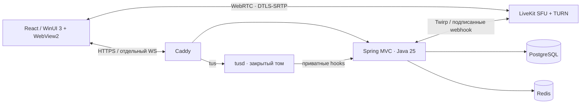
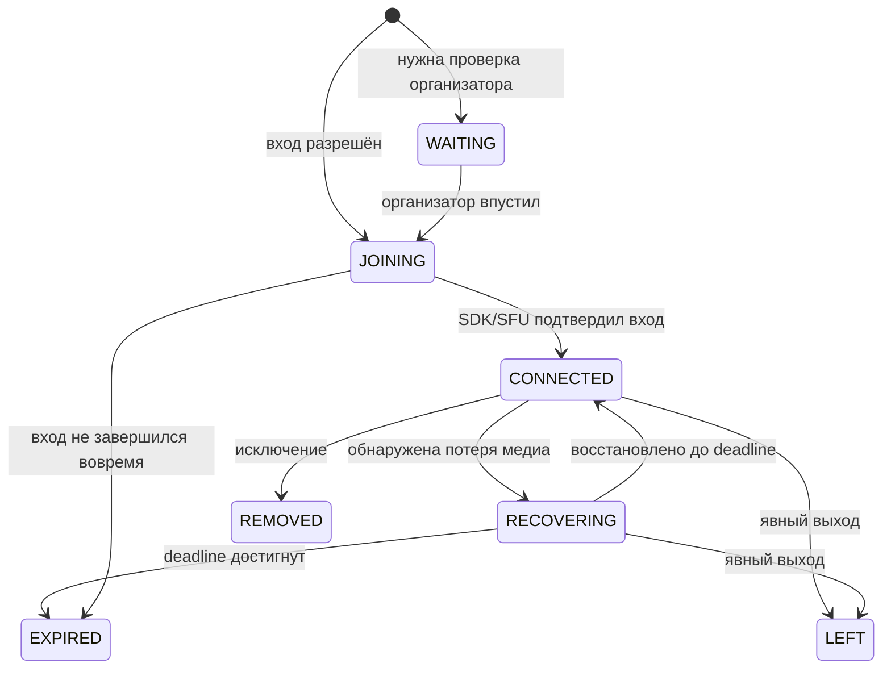

# Архитектура

## Границы ответственности

Девятизначные коды назначаются криптографическим генератором, уникальность закреплена индексом PostgreSQL. Миграция V4 и обработчик запуска назначают коды существующим комнатам. `POST /api/v1/rooms/join-by-code` подчиняется настройке комнаты «кто может войти» — той же, что и вход по ссылке, — и ограничен по частоте. Когда комната просит подтверждения, запрос становится ожидающим: код не заменяет разрешения на чтение истории, скачивание файлов и публикацию медиа, ожидающий видит только свою запись, а организатор подтверждает его обычной командой допуска.

`POST /api/v1/rooms/{id}/rejoin` — явное возвращение по сохранённому доступу. Комната и история остаются прежними; создаётся новая медиасессия с переносом ранее одобренного доступа и прав организатора. Прежняя сессия помечается заменённой: её отложенный выход/RPC не затрагивает новую identity. Повтор того же commandId возвращает тот же admission, другой запрос старой сессии отклоняется. Исключение участника, лимит мест и завершение комнаты сохраняют силу. При автоматическом восстановлении внутри 20 секунд identity по-прежнему не меняется.

SFU принимает и пересылает кодированные дорожки — он их не пересобирает, поэтому стоит на порядок меньше отправителя: замерено, что одно ядро вывозит 170–200 Мбит/с пересылки, а десять участников в 1080p занимают четверть ядра и 114 МиБ ([capacity.md](capacity.md)). Ядро не переносит кадры через HTTP, WebSocket или Java heap. Микрофон, камера, экран и звук экрана — отдельные публикации. TURN ретранслирует пакеты в сетях, где прямой маршрут к SFU недоступен. Шлюз HTTP проверяет права при входе, но не стоит на пути каждого UDP-медиапакета. Основа — [self-hosting LiveKit](https://docs.livekit.io/transport/self-hosting/).

Сервер — модульный монолит. `room` содержит жизненный цикл и транзакции; `media` — LiveKit-адаптер; `attachment` — квоты/загрузки/очистку; `access` — секреты и ограничения; `application` — выполнение команд с внешними последствиями; `api`/`events` — транспорт. Constructor injection, records DTO, Bean Validation, проверяемые ConfigurationProperties. ArchUnit запрещает зависимость комнат от веб-контроллеров и медиатранспорта.

Комната — граница сериализации операций: одна строка `rooms` блокируется `SELECT ... FOR UPDATE`. В ней хранится ограниченный по размеру JSON состояния/прав. Сообщения, вложения, квитанции команд и события — отдельные таблицы. Глобальная блокировка применяется при создании комнаты и резервировании файловой квоты. Для данной нагрузки это делает гонки мест/квот воспроизводимыми; постоянные каналы потребуют отдельной модели долговременных участников и пагинации.

Redis хранит краткоживущую служебную доступность, rate limits и wake-up pub/sub. Источник истины — PostgreSQL. Потерянное уведомление Redis восстанавливается чтением последовательности из БД раз в секунду. `control:<participantId>` не решает, жив ли медиаканал. Локальный профиль использует H2 и ограничения в памяти; производственный — PostgreSQL/Redis.

## Вход на сервер

До входа в комнату есть вход на сервер. `POST /api/v1/session` меняет `stream.access-password`
на токен, подписанный `stream.session-secret`: `<срок>.<HMAC>`. Он ничего не хранит на сервере,
поэтому переживает перезапуск ядра и не требует ключа в Redis на посетителя; он не содержит
ничего, кроме собственного срока, поэтому держатель не может его продлить. Срок — 12 часов.

Пустой пароль оставляет сервер открытым — именно так работали все установки до появления
двери, — и тогда проверка не стоит ничего. При непустом `RequestGuard` закрывает `/api/v1/**`,
кроме `ping`, `capabilities`, `session` и WebSocket `events`: браузер не может поставить
заголовок на upgrade, а первый пакет сокета и так несёт credential комнаты, получить который
можно только через закрытую дверь.

Боты — единственный вызывающий, который рукопожатия не делает. Узнать их по
`X-Internal-Secret` нельзя: шлюз ставит этот заголовок на каждый проксируемый запрос браузера,
то есть он означает «пришло через парадную дверь», а не «свой». Службы присылают тот же секрет
под собственным заголовком `X-Service-Secret`, который шлюз не ставит никогда. На это есть
отдельный тест — на нём держится вся дверь.

Пароль закрывает вход на сервер: создание и вход в комнаты, избранное. Маршруты `/api/v1/services/*`
обслуживает контейнер служб, и они по-прежнему требуют credential комнаты, который без двери
не получить.

## Вход в комнату

1. Предпросмотр прогревает SDK и проверяет разрешения камеры/микрофона, останавливая временные дорожки. Вход слушателем доступен при отказе. Включение устройств и выбор экрана требуют действия пользователя.
2. `POST /api/v1/rooms` либо `/rooms/{id}/join` проверяет `commandId`, приглашение и лимиты в транзакции. UUID команды при повторе с тем же телом возвращает ту же admission; другое тело с тем же UUID получает конфликт.
3. `Admission` содержит логический participantId, индивидуальный credential, recoverySeconds и snapshot. Приглашение содержит лишь случайный секрет гостевого доступа; credential организатора туда не попадает.
4. Управляющий WS отправляет credential первым auth-пакетом. Параллельно клиент получает короткий медиатокен и вызывает `Room.connect`.
5. SDK согласовывает ICE и медиатранспорт. Вход не содержит фиксированных задержек 500/1000 мс. Статус «В эфире» означает установленное SDK-соединение; первый удалённый кадр измеряется отдельно.

Приглашение хранится в fragment (`#invite=...`), не в журналируемой части URL. Оно живёт до 24 часов/закрытия/отзыва. Имя — отображаемая строка, не идентичность. При подтверждении организатором WAITING занимает место, но не получает медиатокен.

## Восстановление и поколения

Клиент использует монотонное `performance.now()`, сервер — Clock/epoch milliseconds. Двадцать секунд начинаются при обнаружении потери. Повторные попытки, повторный `media.lost` и обновления служебного соединения не продлевают срок. SDK — единственный владелец ICE/signaling-повторов. Полный `connect` запускается приложением лишь после перехода SDK в disconnected. Backoff: 0 / 0,5 / 1 / 2 / до 3 секунд с небольшим jitter. `online` ускоряет попытку, не доказывая доступность.

`generation` и SID/время SFU-наблюдения отбрасывают старые события. Клиент последовательно отправляет `media.lost`/`media.restored`, чтобы запоздалый HTTP-запрос не отменил восстановление. `clientReportedLoss` не позволяет очередному списку SFU ошибочно погасить deadline, пока сам клиент ещё не восстановился. Deadline-обслуживание отделено от долгого I/O планировщиком.

Служебный WS восстанавливается самостоятельно: потеря чата не вызывает `Room.disconnect`. После auth сервер отдаёт пропущенные события; если окно истории очищено — snapshot. Разрыв ядра не уничтожает исправный RTP-поток. После 20 секунд и после явного выхода автоматического возвращения нет. `PARTICIPANT_REMOVED`, `ROOM_DELETED`, `DUPLICATE_IDENTITY` завершают клиент немедленно.

Камера/микрофон запоминают желаемое состояние. SDK восстанавливает существующие публикации при своих reconnect; сохранённый живой захват экрана используется повторно, остановленный браузером требует нового пользовательского разрешения. Подробнее — [подключение LiveKit](https://docs.livekit.io/intro/basics/connect/) и [ReconnectPolicy](https://docs.livekit.io/reference/client-sdk-js/interfaces/ReconnectPolicy.html).

## Отзыв доступа

Медиатокен первоначально живёт 60 секунд и ограничен конкретной комнатой, identity и источниками. Экран разрешается отдельной атомарной командой после получения захвата. При третьем запросе дорожки сразу останавливаются.

На self-hosted LiveKit одного удаления участника недостаточно: старый токен может оставаться пригодным для входа. Поэтому **каждый внешний `/rtc` и `/rtc/*` handshake проходит `forward_auth`**. Ядро проверяет подпись/issuer/expiry, комнату, состояние и разрешённые источники. Серверные Twirp API не публикуются. После исключения БД фиксирует запрет, затем dispatcher вызывает RemoveParticipant. Reconciler повторяет удаление при временной ошибке SFU. Закрытая комната перестаёт опрашиваться только после подтверждённого отсутствия медиа-участников. [Поведение токенов LiveKit](https://docs.livekit.io/frontends/reference/tokens-grants/).

Не отключать firewall для 7880: прямой доступ к этому порту обошёл бы HTTP-шлюз. E2EE между участниками в эту версию не входит; TLS/DTLS-SRTP защищают транспорт до VPS, которому пользователи доверяют.

## Данные и идемпотентность

`expiresAt = min(createdAt + 24h, closedAt + 1h)`. До закрытия вторая граница отсутствует. Доступ проверяется при каждом чтении независимо от физического sweep. Новая неиспользованная комната закрывается через 5 минут; использованная — через 60 секунд без активных/восстанавливающихся/ожидающих участников.

Событие: версия 1, UUID, возрастающий sequence, тип и типизированный payload. Команда: commandId, допустимый тип, параметры, при необходимости generation. БД хранит fingerprint запроса и результат в той же транзакции. Отсутствующий ACK допускает повтор через REST с тем же UUID. Это гарантирует однократное изменение внутри срока квитанции, а не «ровно одну» сетевую доставку.

Окно доставки: максимум 1000 событий и час. История сообщений ограничена 1000 сообщениями на комнату; исторические входы — 500. При необходимости освобождаются неактивные записи старше суток, на которые не ссылается избранное. Квитанции связаны с комнатой и также удаляются по сроку. Данные чата не сохраняются в localStorage/sessionStorage; там остаются только настройки и данные доступа/комнаты. Никакие сообщения и файлы не включать в резервные копии или request-body/access-token логи.

Вложения: 100 МиБ/файл, 1 ГиБ/комната, 10 ГиБ/сервер, один незавершённый upload участника, час на завершение. Core сначала резервирует квоту. tusd pre-create проверяет владельца, размер и UUID; каждый HEAD/PATCH снова проходит шлюз. Публичный GET/DELETE tus запрещён; скачивание идёт через core с авторизацией и attachment/nosniff. После post-finish проверяется размер и вычисляется SHA-256.

Отмена сначала делает файл недоступным в БД. Очистка затем вызывает приватный tus DELETE, чтобы согласовать удаление с активным PATCH, и освобождает квоту после успеха. Сетевые вызовы очистки не держат блокировку комнаты. Осиротевшие файлы после прерванного создания также подбираются sweep. При отказе tusd/диска квота остаётся зарезервированной и удаление повторяется. [Протокол tus](https://tus.io/protocols/resumable-upload), [hooks tusd](https://tus.github.io/tusd/advanced-topics/hooks/).

## Избранное и повторное использование комнаты

Миграция V5 добавляет `favorites(profile_hash, room_id, member_id, saved_at)` и абсолютный `expires_at` для сообщений/вложений. Случайный секрет профиля содержит 32 байта энтропии, передаётся как Bearer и хранится сервером только в виде SHA-256. Это доступ конкретного браузерного/Windows-профиля, а не идентификация по отображаемому имени. Разные устройства получают отдельные профили; автоматической синхронизации избранного между ними без аккаунта нет.

| Контракт | Действие |
| --- | --- |
| `GET /api/v1/favorites` | Метаданные собственных сохранённых комнат |
| `PUT /api/v1/favorites/{roomId}` | Сохранить по действующему `roomCredential`; без ограничения числа, проверка допуска |
| `DELETE /api/v1/favorites/{roomId}` | Удалить только собственную закладку |
| `POST /api/v1/favorites/{roomId}/join` | Явный вход с `commandId` и именем, восстановление ранее предоставленных прав |

Глобальная блокировка и блокировка комнаты защищают лимит избранного, места и лимит работающих комнат. Неактивные определения сохранённых комнат не занимают рабочий слот. Окончание пустого разговора через 60 секунд сохраняется; физическое удаление определения запрещено, пока существует хотя бы одна закладка. Если разговор завершён, вход через избранное открывает тот же roomId, название и код. Приглашение не передаёт права организатора, а исключённый участник не может обойти запрет через свою закладку.

Перед новым разговором старые сроки фиксируются как `min(предыдущий expires_at, createdAt + 24h, closedAt + 1h)`. Сброс `closedAt` при открытии комнаты поэтому не оживляет старые сообщения и файлы. Сохранение комнатой постоянного адреса не означает постоянного хранения её содержимого.

## Windows и живое воспроизведение

Соседний проект `ModernStreamingSystem.Windows` использует .NET 10, WinUI 3 и WebView2. Нативная оболочка владеет окном, темой, конфигурацией сервера, DPAPI-профилем и уведомлениями о смене сети. React/LiveKit владеют медиасессией и захватом. Bridge версии 1 принимает только известные команды с фиксированного origin; отдельный C# HTTP-клиент получает лишь избранное. Подробности и источники — в документации Windows-проекта.

Нативное изменение сетевого адреса ускоряет существующую попытку восстановления SDK через bridge и не создаёт второй цикл reconnect. Закрытие окна во время встречи отправляет явный выход, ожидая подтверждение не более 2,5 секунд.

WebRTC сохраняет синхронизацию связанных аудио/видеопотоков. Клиент задаёт запас буфера отдельно по классу дорожки: разговор короткий, музыка и звук демонстрации — заметно длиннее, потому что их никто не перебивает ([resilience.md](resilience.md)). `jitterBufferTarget` не гарантирует конкретную задержку. Проверка каждые две секунды учитывает интервальную статистику и видимость видео. Шесть секунд устойчивого чрезмерного буфера — сверх того, что клиент запросил сам, — либо недекодируемых новых кадров вызывают обновление связанных подписок, с защитой от повторов чаще 30 секунд и от устаревших callbacks. Она не перезапускает собственную камеру/экран и не корректирует `currentTime` живого потока. Настоящая синхронность и glass-to-glass latency требуют измерений на устройствах. [Семантика jitterBufferTarget](https://developer.mozilla.org/en-US/docs/Web/API/RTCRtpReceiver/jitterBufferTarget), [подписки LiveKit](https://docs.livekit.io/reference/client-sdk-js/classes/RemoteTrackPublication.html).

## Наработки предыдущих проектов

Основание — указанные в плане версии [cord](https://github.com/MikkiMays/cord/tree/169fc85a7cb8376a109ce211cb01473989beefff), [cord_react](https://github.com/MikkiMays/cord_react/tree/05aa10ee560155b3444e3eb5ead38f7aefcfd78d) и [jarvis-admin-panel](https://github.com/MikkiMays/jarvis-admin-panel/tree/3e0e5c44273a194ca3fbf1a06b81bb27d036bc92).

Переиспользованы сценарии встреч, включения устройств, профилей и диагностики, а не старый signaling-код. Из cord убраны привязка identity к WebSocket и ожидания перед подключением; из cord_react — общий профиль по худшему участнику и монолитный компонент звонка. У Jarvis учтены настоящий WHEP-поток, измерение статистики по интервалам и граница между просмотром и управлением. P2P/WHEP не смешиваются с топологией текущей комнаты.

## Настройки встречи после создания

`room.title` и `room.approvalRequired` присваивались ровно один раз, в `RoomService.create`, и
поменять их было нечем: опечатку комната несла до конца, а решение «пускаю всех» приходилось
принимать до того, как стало понятно, кто придёт. `PUT /api/v1/rooms/{roomId}/settings` меняет
оба, только для ведущего и только в открытой комнате — тем же порядком, что настройки
интеграций рядом: замок, участник, права, изменение, `room.changed`. Объявление обязательно:
без него новое название знал бы только тот, кто его ввёл.

Ловушка, которую видно только в контракте: springdoc именует схемы по простому имени типа, и
второй `Settings` в том же API **подменяет** схему настроек интеграций. Поэтому запись
называется `RoomSettings`, а метод контроллера — `updateRoomSettings`: одинаковые имена методов
превращают operationId в `update` и `update_1`.
