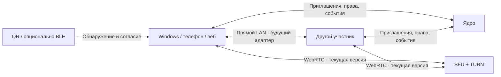

# Минимальная задержка: решение для Cord и Jarvis

Исследование и изменения от **8 сентября 2026**. Практические команды и порядок размещения — в [инструкции для текущего VPS](frankfurt-installation.md). Это решение разделяет работающие возможности, результаты просмотра исходников и будущие эксперименты. Производственные задержки пока не измерены нами.

## Решение

1. Сохранить текущее ядро во Франкфурте. Для общего общения Cord использовать прямой WebRTC/UDP **к LiveKit SFU**, с TURN/TLS 443 для ограниченных сетей. Медиа не проходит через Java, WebSocket с сообщениями, Cloudflare Tunnel или HTTP-прокси.
2. Регистратор NIC.ru и DNS Cloudflare могут остаться. Для новых `meet`, `rtc`, `turn` создать **DNS only** записи непосредственно на VPS. Покупка российского домена не сокращает маршрут уже установленного медиасоединения. Это следует из [различия DNS only и HTTP proxy](https://developers.cloudflare.com/dns/proxy-status/).
3. Для устройств в одной сети исследовать **прямой локальный медиатранспорт**, сначала один отправитель и один получатель. Контроль доступа остаётся у ядра. Для браузеров сравнивать прямой WebRTC; для нативного пульта — отдельный UDP-транспорт с аппаратным кодированием и выводом. Близость устройств сама по себе не переключает нынешний LiveKit-клиент в P2P.
4. Bluetooth использовать только как возможный способ обнаружения и подтверждения пары. Большой видеопоток передавать по Ethernet/Wi-Fi. Сегодняшний минимум покупки — **ничего**, пока не проверены длительная отдача и реальные маршруты. Для полной целевой нагрузки нужен другой класс гарантированной полосы.

## Что известно о сервере

Последние сведения пользователя: Ubuntu 24.04.4, KVM, 6 vCPU на хосте Ryzen 5950X, 15 ГБ usable RAM, примерно 11 ГБ доступно; после очистки **84–90 ГБ свободно** на диске 128 ГБ. Диск расширять сейчас не требуется. Активны 14 контейнеров, включая Jarvis, MediaMTX и Caddy. IP `108.165.32.23`, действующий сайт **nikg.tech**. Имя машины `jarvis-core-kiki.com` не обязательно является рабочей публичной DNS-записью.

Переданные измерения: загрузка 342–486 Мбит/с, медиана около 468; отдача 276 Мбит/с короткой отправкой 20 МБ. Это доступная скорость **в том конкретном тесте**, не доказательство ни 500-Мбит, ни гигабитного тарифа. `virtio_net Speed: Unknown` не сообщает физическую скорость. Договорная полоса и месячный трафик узнаются у продавца VPS. Указанный в отчёте AS213529/Sculk — сведения о сети; юридический продавец может быть реселлером.

Steal 4–8% в покое, до 12% под нагрузкой, среднее 6,35% — основание измерить нестабильность исполнения. По 16 секундам нельзя установить алгоритм шейпера CPU или обещать «5,6 постоянно доступных ядер». Для SFU важны краткие задержки обработки пакетов, а не только средняя загрузка. Сборки Gradle лучше выполнять вне хоста живых звонков; отсутствие перекодирования на SFU снижает расход CPU, но не исключает влияние соседей на гипервизоре.

В этой сессии `nikg.tech` разрешался в адреса Cloudflare; `jarvis-kiki-bot.com` и `jarvis-core-kiki.com` давали NXDOMAIN. Это наблюдения из нашей сети, не основание менять уже работающий сайт. Локальный ICMP до указанного IP дал подозрительные <1 мс и TTL 128: **этот результат не принят за замер Франкфурта**. Для планирования используем сообщённые пользователем RTT 50–60+ мс и повторяем измерения из реальных сетей.

## Почему «RTT 58 мс → 300 мс» не является расчётом

Для изображения через один SFU:

```text
задержка = ожидание захвата + кодирование + путь A→SFU + очередь SFU
         + путь SFU→B + восстановление/буфер приёма + декодирование + вывод
```

При симметричных маршрутах и RTT обоих устройств до SFU по 58 мс сеть даёт примерно **29 + 29 = 58 мс в одну сторону**. Для действия на пульте и обратного изображения через те же маршруты — около 116 мс сети, плюс обработка. Итоговые 240–300 мс вполне возможны, но требуют измерения остальных слагаемых. Смена DNS не уберёт очередь энкодера, SRT-буфер или задержку декодера. При 60 FPS один кадр занимает 16,7 мс; несколько накопленных кадров уже ощутимы.

Цель «30–60 мс в локальной сети» разумна для эксперимента с подходящим оборудованием; это пока **бюджет**, а не измеренный результат. Для пульта важен input-to-photon, для разговора — отдельная задержка аудио, для экрана — glass-to-glass. RTT не заменяет ни один из этих показателей.

## Проверка предложенного Клодом прямого UDP

Сильная часть предложения — убрать поездку пакетов из квартиры во Франкфурт и обратно. Это полезно и для задержки, и для исходящего трафика SFU. Однако **прямая топология и WebRTC не противоречат друг другу**: ICE может выбрать локальную пару, и медиа пойдёт между устройствами по UDP. STUN/TURN не обязаны находиться на пути каждого пакета. Механику показывает [Pion WebRTC](https://github.com/pion/webrtc).

В WebRTC нет универсального обязательного буфера «30–60 мс». `jitterBufferTarget` — пожелание приложения; фактическое значение зависит от сети, декодера и синхронизации с аудио. Браузер может удерживать больше, чем запрошено. Поддержка различается. Проверять надо разности `jitterBufferDelay` и `jitterBufferEmittedCount`, а не одно присвоенное число. [Спецификация](https://w3c.github.io/webrtc-pc/#dom-rtcrtpreceiver-jitterbuffertarget), [описание и совместимость](https://developer.mozilla.org/en-US/docs/Web/API/RTCRtpReceiver/jitterBufferTarget).

В Cord устранён собственный запрос дополнительных 50 мс: клиент теперь просит минимальную приемлемую буферизацию одинаково для аудио и видео, сохраняя право браузера на адаптацию. Это **не отключение jitter buffer** и не гарантия выигрыша в 50 мс. При потере пакетов избыточно агрессивные настройки могут увеличить число фризов, поэтому сравниваются p95 задержки, кадры и звук вместе.

Для нативного пульта специализированный UDP может выиграть за счёт всего конвейера: GPU-захват → аппаратный encoder без длинной очереди → передача → аппаратный decoder → быстрый вывод. Сам вызов `UdpClient.SendAsync` эту задачу не решает. Потребуются пакетизация с учётом MTU, порядок/срок жизни кадров, pacing, управление перегрузкой, обработка потерь, запрос ключевого кадра, шифрование, защита от повторов, общий clock аудио/видео и повторный handshake при смене сети. Wi-Fi тоже теряет и переставляет пакеты.

Изготовление нового протокола не является первым шагом. Референс — Sunshine/Moonlight; для сравнения — прямой WebRTC на тех же GPU и экранах. Код сторонних проектов переносится только после проверки лицензии. Для NVENC отправная точка — режим low/ultra-low latency, короткий VBV, отсутствие ненужного lookahead и очереди повторного упорядочивания; окончательный preset выбирается по измерению качества и скорости. Аналогичная проверка нужна для Intel/AMD. [Руководство NVENC](https://docs.nvidia.com/video-technologies/video-codec-sdk/13.0/nvenc-video-encoder-api-prog-guide/index.html).

Заявление «одноразовый ключ через существующий relay, ядро не меняется» пока не подтверждено исходниками. Relay можно переиспользовать, **если** он уже проверяет отправителя, адресата и право на сессию; одноразовость проверяется атомарно получателем/сервером, ticket привязан к участникам и поколению, ограничен временем, а исключение отзывает прямую сессию. Неизвестны реализация протокола, измерительная методика и порог пересмотра решения Клода; в этой сессии предоставлен только вывод, поэтому его числа не выдаются за проверенный benchmark.

## Что найдено в Jarvis

Аудит [jarvis-admin-panel, commit 3e0e5c4](https://github.com/MikkiMays/jarvis-admin-panel/tree/3e0e5c44273a194ca3fbf1a06b81bb27d036bc92):

- [whep.ts](https://github.com/MikkiMays/jarvis-admin-panel/blob/3e0e5c44273a194ca3fbf1a06b81bb27d036bc92/frontend/src/console/whep.ts) различает JPEG по WebSocket и настоящий WHEP/WebRTC. Следовательно, утверждение «там всё картинками» ко всему проекту не относится. Сначала выясняется активный режим в конкретном звонке.
- [quality.ts](https://github.com/MikkiMays/jarvis-admin-panel/blob/3e0e5c44273a194ca3fbf1a06b81bb27d036bc92/frontend/src/console/quality.ts) содержит 1080p60 с 8 Мбит/с и 1440p60 с 12 Мбит/с. Наличие пресета не доказывает, что его выдаёт текущий encoder.
- [MediaMTX](https://github.com/MikkiMays/jarvis-admin-panel/blob/3e0e5c44273a194ca3fbf1a06b81bb27d036bc92/infra/mediamtx/mediamtx.yml) принимает SRT и выдаёт WebRTC/WHEP, с UDP/TCP 8189 и объявляемым публичным IP. Проверять нужно правильность `KIKI_PUBLIC_IP`, доступность 8189, выбранную ICE-пару, SRT latency и encoder. Исходники нового локального транспорта Клоди в этот аудит не входили.

При WHEP HTTPS-сигналинг может пройти Cloudflare, а RTP уже идти прямо на IP MediaMTX. Отключение Cloudflare не исправит задержку SRT само по себе. MediaMTX может перепаковывать поток без декодирования; «9 Мбит/с в каждую сторону» для одного зрителя — умеренная полоса, а CPU перепаковки надо измерять. Затраты растут с числом зрителей; их нельзя автоматически приравнять к CPU перекодирования.

Cloudflare документировал ограничения доступа у российских провайдеров в июне 2025. Это аргумент отдельно проверить прямой доступ, **не доказательство причины сегодняшних фризов**. [Сообщение Cloudflare](https://blog.cloudflare.com/russian-internet-users-are-unable-to-access-the-open-internet/).

## Три маршрута одного продукта



**Интернет и группы:** единая SFU-комната, отдельные camera/mic/screen/screen-audio, индивидуальные уровни подписки. Обычный self-hosted LiveKit размещает комнату на одном узле: несколько VPS не означают, что каждый участник одной комнаты автоматически подключается к ближайшему SFU. Регион выбирается для комнаты по измерениям всех участников. [Распределённое размещение](https://docs.livekit.io/transport/self-hosting/distributed/).

**LAN один-на-один:** после входа через ядро клиенты обмениваются поддерживаемыми транспортами и короткоживущим ticket. Прямое соединение проверяется без остановки текущего разговора. После первого декодированного ключевого кадра и готовности аудио меняется активный renderer пары; два звука одновременно не включаются. Собственные capture tracks переиспользуются, вторая постоянная очередь кодирования не создаётся. Старый маршрут освобождается после подтверждения нового. Если аппаратные/браузерные ограничения не позволяют такую подготовку, остаётся SFU, а не две конкурирующие трансляции.

**Локальная группа:** произвольная mesh из десяти участников умножает исходящие потоки и нагрузку телефонов. Следующий вариант — локальный SFU/edge с явным обнаружением и проверенным TLS; он тоже требует отдельного размещения и интеграции. «Оба в одном Wi-Fi» не доказывает доступность: guest isolation, VPN и корпоративный firewall могут блокировать прямой маршрут.

Параметры будущего переключателя для проверки, а не уже включённые настройки: 5 секунд устойчивого выигрыша перед переходом, 10 секунд защиты от частых обратных переключений; быстрое возвращение к SFU при потере LAN. Пробы не продлевают общий 20-секундный срок потери медиа. `participantId` не меняется, поколение соединения отсеивает старые callbacks, выход/исключение закрывают **все** транспорты. При недоступном ядре новые права не выдаются; полноценный автономный offline-режим — отдельное решение.

## Bluetooth и устройства рядом

Широко используемые Classic EDR и LE 2M имеют физические скорости до 3 и 2 Мбит/с соответственно, полезная скорость ниже. Это не транспорт для нашего экранного слоя до 16 Мбит/с. Новые спецификации в разработке нельзя считать установленной возможностью всех телефонов. [Bluetooth technology overview](https://www.bluetooth.com/learn-about-bluetooth/tech-overview/), [спецификации в разработке](https://www.bluetooth.com/specifications/specifications-in-development/).

Первый универсальный способ — QR с HTTPS-приглашением. Для нативных клиентов BLE может рекламировать случайный регулярно сменяемый идентификатор обнаружения, без имени комнаты и секрета доступа. Пользователь подтверждает пару, ядро выдаёт ticket, затем пробуется Wi-Fi/Ethernet или поддерживаемый Wi-Fi Direct. RSSI означает близость приблизительно; это не авторизация и не доказательство одной сети.

Web Bluetooth доступен не везде и требует пользовательского действия. Нельзя обещать автоматическое фоновое обнаружение в Safari/iPhone-вебе. Доступ браузера к локальной сети тоже имеет ограничения и развивающуюся модель разрешений. Для телефона универсальным остаётся WebRTC и QR; нативная nearby-интеграция определяется платформой. [Web Bluetooth](https://developer.mozilla.org/en-US/docs/Web/API/Bluetooth), [Chrome Local Network Access](https://developer.chrome.com/blog/local-network-access), [Google Nearby](https://developers.google.com/nearby/connections/overview).

## Проверенные открытые проекты: 14 источников кода

| Проект                                                                                                           | Что использовать в проектировании                        | Граница применения                                                   |
| ---------------------------------------------------------------------------------------------------------------- | -------------------------------------------------------- | -------------------------------------------------------------------- |
| [LiveKit server](https://github.com/livekit/livekit)                                                             | SFU, слои, TURN, жизненный цикл комнат                   | Основа текущего интернет-режима; не локальный P2P переключатель      |
| [LiveKit JS SDK](https://github.com/livekit/client-sdk-js)                                                       | Публикации, ICE recovery, подписки, статистика           | Общий веб/WebView2-клиент; не отдельный нативный encoder             |
| [Pion WebRTC](https://github.com/pion/webrtc)                                                                    | Прямой WebRTC, ICE, RTP/RTCP, interoperable прототип     | Не готовый C# интерфейс звонков                                      |
| [coturn](https://github.com/coturn/coturn)                                                                       | TURN UDP/TCP/TLS и тесты ограниченных сетей              | Альтернатива/стенд; не ставить вторым relay на занятые порты LiveKit |
| [MediaMTX](https://github.com/bluenviron/mediamtx)                                                               | WHEP/WHIP/SRT, аудит существующего Jarvis                | Репакетизация не гарантирует малый upstream-буфер                    |
| [Sunshine](https://github.com/LizardByte/Sunshine)                                                               | Захват, аппаратное кодирование, игровой профиль задержки | Не drop-in библиотека комнат; учитывать лицензию                     |
| [Moonlight Qt](https://github.com/moonlight-stream/moonlight-qt)                                                 | Аппаратное декодирование, вывод, измерение LAN           | Клиент игрового протокола, не браузерный WebRTC                      |
| [scrcpy](https://github.com/Genymobile/scrcpy)                                                                   | Практики малых очередей, Android USB/Wi-Fi               | Требует Android/ADB; не общая схема пользовательских встреч          |
| [LocalSend](https://github.com/localsend/localsend)                                                              | Обнаружение LAN, понятное подтверждение устройства       | Обмен файлами, не видеотранспорт                                     |
| [Google Nearby](https://github.com/google/nearby)                                                                | Разделение discovery и фактического канала данных        | Поддержка зависит от платформы/SDK                                   |
| [NearDrop](https://github.com/grishka/NearDrop)                                                                  | Практические ограничения nearby-совместимости            | Частичная реализация обмена, не универсальный звонок                 |
| [Windows WiFiDirect sample](https://github.com/microsoft/Windows-universal-samples/tree/main/Samples/WiFiDirect) | WinRT discovery/pairing/подключение                      | Зависит от драйвера, capability и второго устройства                 |
| [Caddy L4](https://github.com/mholt/caddy-l4)                                                                    | Совместное SNI-разделение HTTPS и TURN/TLS 443           | Дополнительный модуль, закрепляем версию; нужен Linux TLS-тест       |
| [iperf](https://github.com/esnet/iperf)                                                                          | Воспроизводимые TCP/UDP-тесты обоих направлений          | Не измеряет задержку изображения и кодировщика                       |

Это набор изученных инженерных ориентиров, а не четырнадцать новых зависимостей приложения. В текущей поставке остаются LiveKit, Caddy и существующий клиентский стек.

## Что реализовано сейчас

- Windows: компактная центральная главная, пять избранных комнат, вариант для низкого окна, нативная анимация SplitView; один WebView2 сохраняется при скрытии панели. Общий web UI остаётся адаптивным.
- Диагностика: выбранная ICE-пара, прямое соединение к SFU или TURN, различение TURN/TLS по `relayProtocol`, RTT до SFU, кодек, обработчик видео, среднее encode/decode и jitter buffer **по интервалу**. Отсутствующие потери не отображаются как доказанные 0%.
- Устранён фиксированный запрос буфера 50 мс. Автоматическое восстановление и защита от отставания живого эфира сохранены. Показ фактических метрик не заменяет измерение синхронизации звука и изображения.
- Генератор конфигурации поддерживает существующий Jarvis на одном TCP 443 без переноса его авторизации в Cord. Добавлен ограниченный по времени read-only DNS/TLS/HTTPS аудит.

**Прямой native UDP, BLE discovery, LAN P2P и региональное размещение комнат пока спроектированы, но не включены в приложение.** Для них нужен отдельный сравнимый прототип с замерами. Причина — отсутствие проверенного локального медиаконвейера и второго физического устройства в этой сессии; заменять работающую совместимость экспериментом без измерений нельзя считать выполненной оптимизацией.
